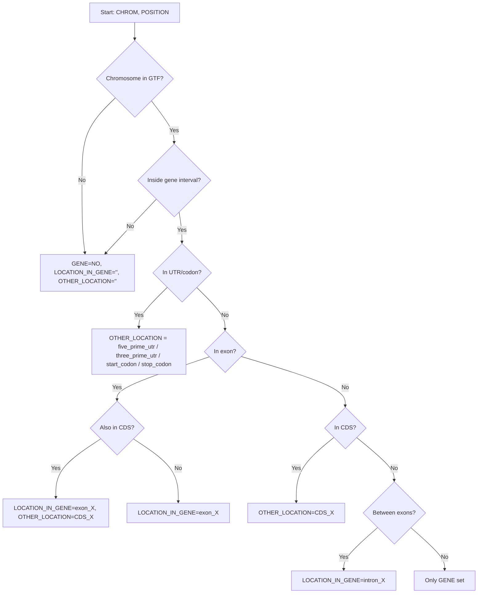

# GTF_Parser

## Get The Code

```bash
git clone https://github.com/BaptisteHerlemont/GTF_Parser.git
cd GTF_Parser
```

## Description

This script reads a GTF file and an Excel sheet of genomic positions, then annotates each position with its gene context. It reports whether the position is inside a gene and which feature it overlaps (exon, intron, CDS, UTR, or codons). The output is the original Excel file with three added annotation columns.

## Quick Example 

A tiny synthetic dataset is included so you can test the script without downloading any external data:

```bash
python3 GTF_parser.py --example
```

This uses:
- `examples/toy.gtf`
- `examples/toy.xlsx`

And writes:
- `examples/toy_output.xlsx`

The bundled example is fully synthetic (no Ensembl data redistributed).

## Input Files

- `input.gtf`  
A GTF (Gene Transfer Format) file containing genomic features such as genes, exons, CDS, UTRs, etc.

- `input.xlsx`  
An Excel file containing at least the following two columns.  
`CHROM`: chromosome name (must match the GTF).  
`POSITION`: genomic position of interest (1-based, inclusive).

## Output File

- `output.xlsx`  
A copy of the input Excel file with three additional columns.  
`GENE`: gene name that overlaps the position (or `NO` if none).  
`LOCATION_IN_GENE`: feature inside the gene (e.g., `exon_3`, `intron_2`, or empty).  
`OTHER_LOCATION`: special elements if not exon/intron (e.g., `start_codon`, `stop_codon`, `five_prime_utr`, `three_prime_utr`, `CDS_2`).

## Usage

Run with your own files:

```bash
python3 GTF_parser.py --input-gtf input.gtf --input-excel input.xlsx --output-excel output.xlsx
```

Run the bundled example:

```bash
python3 GTF_parser.py --example
```

## Annotation Rules

- If the position is outside any gene, `GENE = NO` and other columns are empty.
- If the position is within a gene, the script checks features in this order:
- UTRs and codons: `five_prime_utr`, `three_prime_utr`, `start_codon`, `stop_codon`.
- Exons: `LOCATION_IN_GENE = exon_X`, and if the position overlaps a CDS, `OTHER_LOCATION = CDS_X`.
- CDS only: `OTHER_LOCATION = CDS_X` if in CDS but not matched by exon logic.
- Introns: `LOCATION_IN_GENE = intron_X` if the position is between two exons.
- Otherwise: `GENE` is set but `LOCATION_IN_GENE` and `OTHER_LOCATION` stay empty.

## Decision Flow



## Notes

- Only the **canonical transcript** is considered (tagged as `"Ensembl_canonical"` in the GTF).
- The script assumes the GTF uses **1-based inclusive coordinates**.
- Chromosome names in both files must match (e.g., `"1"` vs `"chr1"`).

## Install Dependencies

```bash
pip install pandas tqdm openpyxl
```
